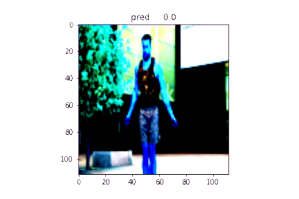
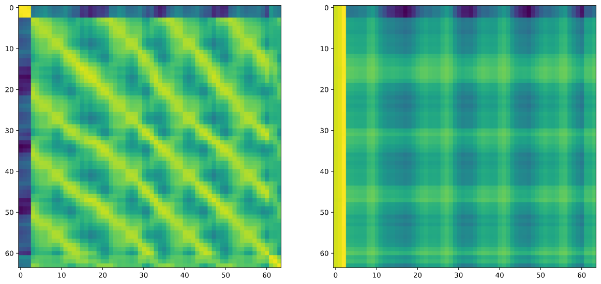
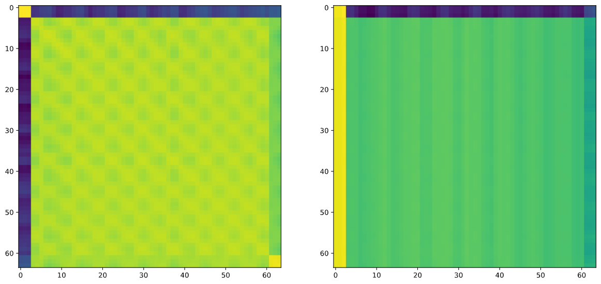

# RepNet-Pytorch
Temporal repetition counting. This repo contains code for the model as mentioned in <a href= "https://arxiv.org/abs/2006.15418"> Counting Out Time</a>. There might be some differences to the version of the paper. There is also a modified version that is part of my college project in `model_inn.py`.

I have used different loss functions to train the model becuase I got better results with them.

Also I created a synthetic dataset for this task using Blender and it seems to work well. <a href="https://drive.google.com/drive/folders/1mbpCs2vae0VqvciLX0staA-iJvprp_Vg?usp=sharing">Link</a>

All the dataset videos are at <a href="https://drive.google.com/drive/folders/1G3BdsyzUK6KjGRV0k5w_yBbmebq-l6tZ?usp=sharing">this</a> directory.

Sample result:

Features created using self similarity and multi headed attention respectively:

